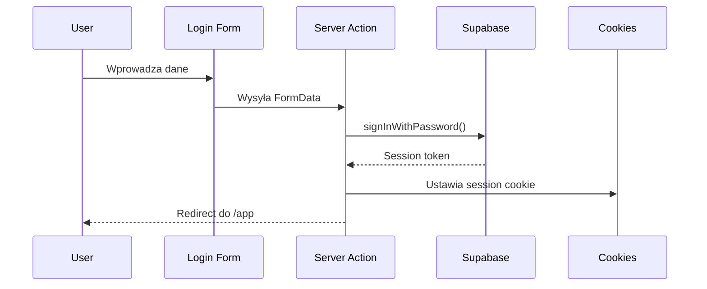
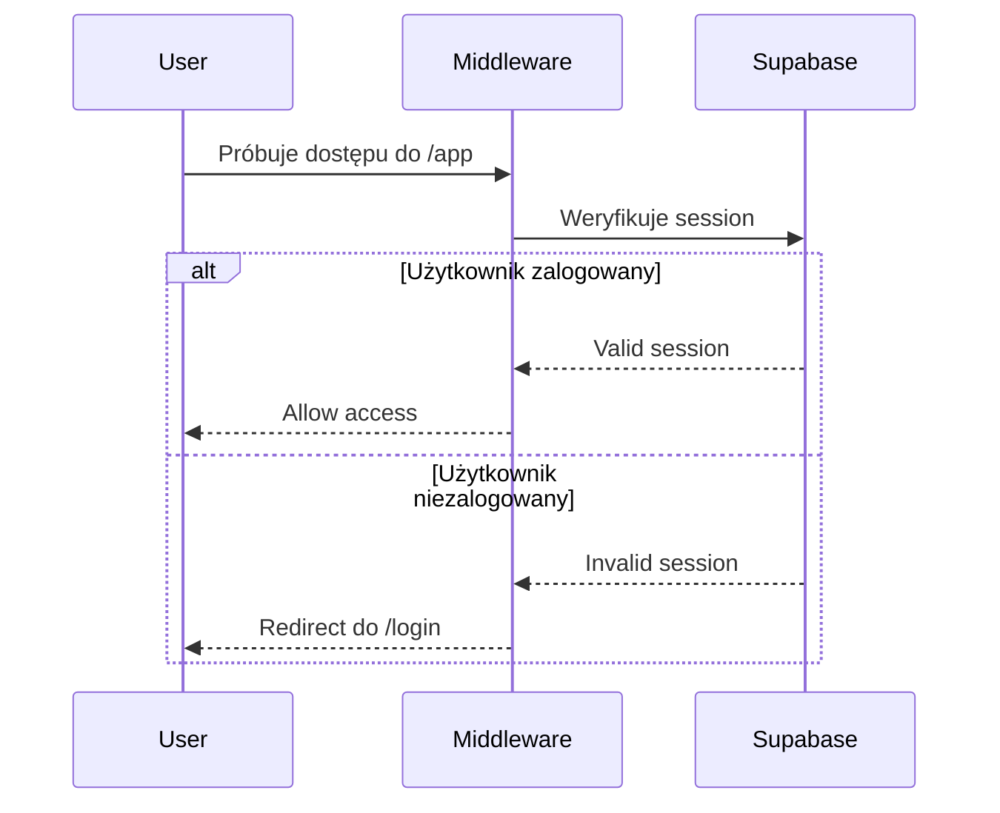

# 🏗️ Architektura Aplikacji

## Przegląd techniczny

Poly Trading Bot to aplikacja zbudowana w oparciu o Next.js 14+ z wykorzystaniem najnowszych wzorców architektonicznych, takich jak Server Components, Server Actions i middleware.

## Stack Technologiczny

### Frontend
- **Next.js 14+** - React framework z App Router
- **React 18** - biblioteka UI z Server Components
- **TypeScript** - type safety
- **Tailwind CSS** - utility-first CSS framework
- **shadcn/ui** - komponenty UI

### Backend & Auth
- **Supabase Auth** - autoryzacja i zarządzanie użytkownikami
- **Supabase SSR** - server-side rendering z Supabase
- **Next.js Server Actions** - server-side mutations
- **Next.js Middleware** - routing guards

### Forms & Validation
- **React Hook Form** - zarządzanie formularzami
- **Zod** - walidacja schematów

### Tooling
- **ESLint** - linting kodu
- **PostCSS** - transformacje CSS

## Struktura Aplikacji

### App Router Structure

```
app/
├── (auth)/              # Grupa routingu dla autoryzacji
│   ├── login/          # Strona logowania
│   ├── register/       # Strona rejestracji
│   └── reset-password/ # Reset hasła
│
├── (dashboard)/        # Grupa routingu dla dashboardu
│   └── app/           # Główny dashboard (chroniony)
│       ├── page.tsx   # Dashboard home
│       ├── trading/   # Strona tradingu
│       ├── analytics/ # Strona analityki
│       └── settings/  # Strona ustawień
│
├── layout.tsx         # Root layout
├── page.tsx           # Landing/redirect page
└── globals.css        # Globalne style
```

### Komponenty

```
components/
├── ui/                # shadcn/ui komponenty
│   ├── button.tsx
│   ├── input.tsx
│   ├── card.tsx
│   ├── form.tsx
│   └── label.tsx
│
├── auth/              # Komponenty autoryzacji
│   ├── login-form.tsx
│   ├── register-form.tsx
│   └── reset-password-form.tsx
│
├── layout/            # Komponenty layoutu
│   ├── sidebar.tsx
│   ├── header.tsx
│   └── user-menu.tsx
│
└── shared/            # Współdzielone komponenty
    └── loading-spinner.tsx
```

### Biblioteki & Utilities

```
lib/
├── supabase/
│   ├── client.ts      # Browser client
│   ├── server.ts      # Server client (SSR)
│   └── middleware.ts  # Middleware helper
│
├── auth/
│   ├── get-user.ts    # Pobieranie zalogowanego użytkownika
│   └── require-user.ts # Guard dla chronionych stron
│
└── utils.ts           # Utility functions (cn)
```

### Server Actions

```
actions/
└── auth-actions.ts    # Server Actions dla auth
    ├── login()
    ├── register()
    ├── logout()
    └── resetPassword()
```

## Przepływ Danych

### 1. Autoryzacja



### 2. Routing Guards



### 3. Server Components Data Fetching

```mermaid
sequenceDiagram
    User->>Dashboard Page: Ładuje stronę
    Dashboard Page->>Server: Server Component render
    Server->>getUser(): Pobiera dane użytkownika
    getUser()->>Supabase: auth.getUser()
    Supabase-->>getUser(): User data
    getUser()-->>Server: User object
    Server-->>User: Renderuje HTML z danymi
```

## Wzorce Architektoniczne

### 1. Server Components (domyślnie)

Wszystkie komponenty są domyślnie Server Components, co zapewnia:
- Renderowanie po stronie serwera
- Bezpośredni dostęp do bazy danych
- Mniejszy bundle JavaScript
- Lepsza SEO

```typescript
// app/(dashboard)/app/page.tsx
export default async function DashboardPage() {
  const user = await getUser() // Bezpośrednie wywołanie
  
  return <div>Welcome {user.email}</div>
}
```

### 2. Client Components (selektywnie)

Używane tylko tam, gdzie potrzebna jest interaktywność:
- Formularze z validacją
- Event handlers
- Stan lokalny
- Browser APIs

```typescript
// components/auth/login-form.tsx
'use client'

export function LoginForm() {
  const [error, setError] = useState<string | null>(null)
  // ... React Hook Form logic
}
```

### 3. Server Actions

Bezpieczne operacje mutujące po stronie serwera:

```typescript
// actions/auth-actions.ts
'use server'

export async function login(formData: FormData) {
  const supabase = await createClient()
  // ... operacje na serwerze
  revalidatePath('/app')
  redirect('/app')
}
```

### 4. Middleware dla Routing Guards

```typescript
// middleware.ts
export async function middleware(request: NextRequest) {
  const { user } = await updateSession(request)
  
  if (!user && request.nextUrl.pathname.startsWith('/app')) {
    return NextResponse.redirect('/login')
  }
}
```

## Wzorce Bezpieczeństwa

### 1. SSR Sessions

Sesje są zarządzane po stronie serwera przez cookies:
- Token nie jest dostępny w JavaScript klienta
- Automatyczne odświeżanie tokenów
- Bezpieczne HTTPOnly cookies

### 2. Type Safety

Wszystko jest typowane przez TypeScript:
- Formularze (Zod schemas)
- API responses (Supabase types)
- Komponenty (React + TypeScript)

### 3. CSRF Protection

Next.js automatycznie chroni przed CSRF w:
- Server Actions
- API Routes

## Performance

### 1. Static Generation

Strony auth są pre-renderowane statycznie:
```
○  (Static)   /login
○  (Static)   /register
○  (Static)   /reset-password
```

### 2. Dynamic Rendering

Dashboard jest renderowany dynamicznie:
```
ƒ  (Dynamic)  /app
ƒ  (Dynamic)  /app/trading
ƒ  (Dynamic)  /app/analytics
```

### 3. Code Splitting

- Automatyczny code splitting przez Next.js
- Lazy loading komponentów Client
- Optymalizacja bundli

## Routing Strategy

### Route Groups

Aplikacja używa route groups dla lepszej organizacji:

```
(auth)/     - Publiczne strony autoryzacji
(dashboard)/ - Chroniony obszar aplikacji
```

### Layouts

Każda grupa ma swój layout:

```typescript
// app/(auth)/layout.tsx - Minimalistyczny layout
// app/(dashboard)/layout.tsx - Pełny dashboard z sidebar
```

## Supabase Integration

### Client Types

1. **Browser Client** (`lib/supabase/client.ts`)
   - Używany w Client Components
   - Operacje po stronie przeglądarki

2. **Server Client** (`lib/supabase/server.ts`)
   - Używany w Server Components
   - Bezpieczny dostęp do sesji

3. **Middleware Client** (`lib/supabase/middleware.ts`)
   - Używany w middleware
   - Weryfikacja sesji przed routingiem

## Skalowanie

Aplikacja jest zaprojektowana z myślą o skalowalności:

### 1. Folder Structure

```
features/
  ├── auth/
  ├── trading/
  ├── analytics/
  └── settings/
```

### 2. Dodawanie Nowych Features

1. Utwórz nową stronę w `app/(dashboard)/app/[feature]/`
2. Dodaj route w sidebar (`components/layout/sidebar.tsx`)
3. Utwórz komponenty w `components/[feature]/`
4. Dodaj Server Actions w `actions/[feature]-actions.ts`

### 3. Database Integration

Gdy będziesz potrzebować bazy danych:
1. Utwórz tabele w Supabase
2. Wygeneruj typy: `npx supabase gen types typescript`
3. Dodaj do `types/database.ts`

## Monitoring & Debugging

### Development

```bash
npm run dev  # Hot reload, source maps
```

### Production

```bash
npm run build  # Type checking, linting
npm run start  # Production server
```

### Linting

```bash
npm run lint  # ESLint check
```

## Deployment Architecture

```
GitHub → Vercel (CI/CD)
         ↓
    Next.js App (Edge Network)
         ↓
    Supabase (Database + Auth)
```

### Edge Deployment

- Aplikacja jest hostowana na Vercel Edge Network
- Middleware działa na edge
- Niskie latencje globalnie

## Best Practices

1. **Server Components First** - używaj Client Components tylko gdy konieczne
2. **Co-location** - trzymaj pliki blisko miejsca użycia
3. **Type Safety** - zawsze typuj wszystko
4. **Error Handling** - zawsze obsługuj błędy
5. **Loading States** - zawsze pokazuj loading states
6. **Accessibility** - komponenty shadcn/ui są accessible

## Przyszłe Rozszerzenia

Architektura wspiera:
- [ ] Database models (Prisma/Drizzle)
- [ ] Real-time subscriptions (Supabase Realtime)
- [ ] API routes dla zewnętrznych integracji
- [ ] WebSockets dla live tradingu
- [ ] Background jobs (Vercel Cron)
- [ ] File uploads (Supabase Storage)
